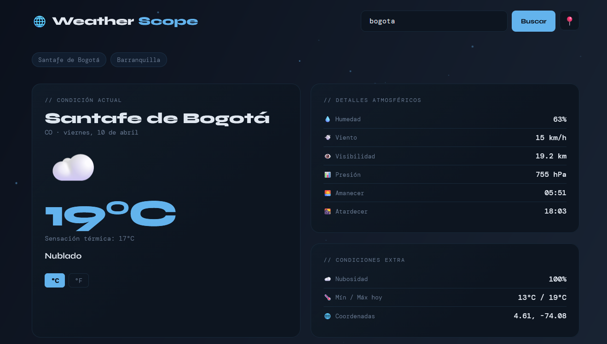

# 🌐 WeatherScope

### Dashboard del clima en tiempo real — elegante, rápido y sin dependencias

 

> Un dashboard del clima construido con HTML, CSS y JavaScript vanilla.  
> Sin frameworks, sin API key, datos reales en tiempo real.

 

[🚀 Ver Demo en Vivo](https://TU_USUARIO.github.io/weatherscope) · [🐛 Reportar Bug](https://github.com/TU_USUARIO/weatherscope/issues) · [💡 Solicitar Feature](https://github.com/TU_USUARIO/weatherscope/issues)

---

## ✨ Características

| Feature | Descripción |
|---|---|
| 🔍 **Búsqueda global** | Busca cualquier ciudad del mundo por nombre |
| 📍 **Geolocalización** | Detecta tu ubicación automáticamente |
| 🌡️ **Clima en tiempo real** | Temperatura, sensación térmica, humedad, viento y más |
| 📊 **Gráfica de pronóstico** | Visualización de temperaturas máximas y mínimas a 5 días |
| 📅 **Forecast 5 días** | Cards con ícono, máx y mín por día |
| 🔄 **°C / °F** | Toggle instantáneo entre unidades |
| 🕓 **Historial** | Últimas 5 ciudades buscadas (guardado en localStorage) |
| 🎨 **Fondo dinámico** | Cambia según la condición del clima |
| ⚡ **Sin dependencias** | Solo HTML + CSS + JS vanilla |

---

## 🖥️ Vista previa

### Pantalla principal

### Pronóstico a 5 días

---

## 🌍 APIs utilizadas

Este proyecto usa APIs **100% gratuitas** sin necesidad de API key ni registro:

| API | Uso | Docs |
|---|---|---|
| [Open-Meteo](https://open-meteo.com) | Datos del clima y pronóstico | [Documentación](https://open-meteo.com/en/docs) |
| [Open-Meteo Geocoding](https://open-meteo.com/en/docs/geocoding-api) | Convertir nombre → coordenadas | [Documentación](https://open-meteo.com/en/docs/geocoding-api) |
| [Nominatim](https://nominatim.openstreetmap.org) | Geocoding inverso para geolocalización | [Documentación](https://nominatim.org/release-docs/latest/) |

---

Hecho con ❤️ y JavaScript vanilla

⭐ Si te gustó el proyecto, ¡dale una estrella!

